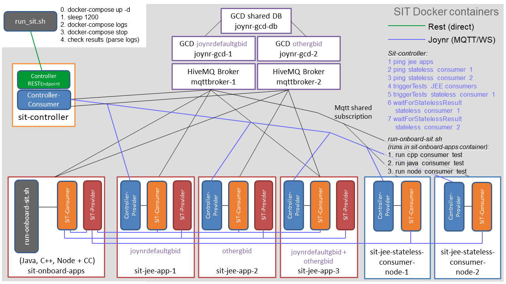

# System Integration Tests - Docker

In order to run the system integration tests, you need to have built
or have available the various Docker Images which are used by
the `docker-compose.yml` script contained in this directory.

There are several sub-directories, which contain build scripts
for creating the images. See their individual README.md's for
instructions on how to build them.

## Test scenario

## Building

The easiest way to build all necessary images is to execute the

`./build_all.sh`

script in this directory. Alternatively, look inside the script
to see what it does, and execute any or all of the steps
manually if you want more control over what's built.

## Running the scenario

Once you have built all the necessary Docker Images, you
can start up the scenario by executing the following script:

`run_sit.sh`

Alternatively, you can also start up the scenario manually by
executing the following commands:

`docker-compose up -d`

Check for progress of the various containers by running:

`docker-compose logs`

In order to shutdown and remove the containers, issue the
following commands:

`docker-compose stop`

and

`docker-compose rm -f`

### Older Docker (<= 1.9)

The `docker-compose.yml` file is in the new format, which is
available from Docker 1.10+. With the new version the networking
feature is activated by default. In older Docker versions, you
have to do this manually, by specifying the `--x-networking`
option with your `docker-compose` command, e.g.:

`docker-compose up -d --x-networking`

You will also have to delete the `version: 2.0` and `services`
lines, and shift the rest of the file to the left one level.
